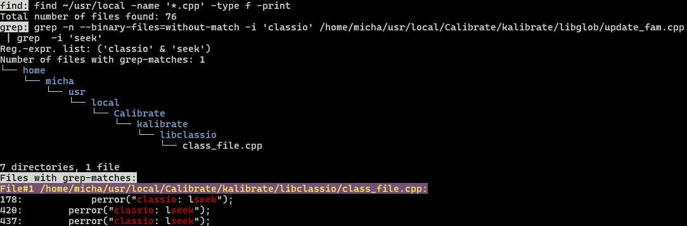

# findngrep
findngrep is a bash shell script combining find-grep commands in a manner
that tries to ease your typing-life.

For example, under my directory `~/usr/local`, I am looking for all `*.cpp` source files which contain the two strings *classio* and *seek*. A first start would be something like:
```shell
find ~/usr/local -name '*.cpp' -exec grep -i classio {} \; | grep -i seek
```
which in my example case produces this: 
```shell
            perror("classio: lseek");
        perror("classio: lseek");
        perror("classio: lseek");
```
Great, but which files contain these matching lines, and what are their line numbers?
Of course, you can start tweaking the above command accordingly, probably ending up
with a long command. Let's skip this and just show the alternative:
```shell
findngrep -f "~/usr/local -name '\*.cpp'" -i -t classio seek
```
which produces this (the tree-display is optional):


findngrep tells me the matching files (here, it's only one) together with line-number information.

## Installation  
If the above seems useful to you, just put the script `findngrep` in your executable path and type
```shell
findngrep -h
```
for a help screen and more examples (q to exit help).
